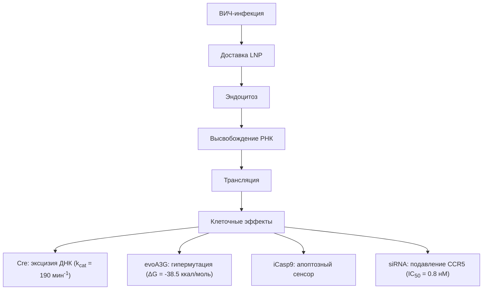
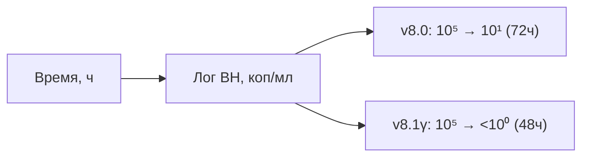
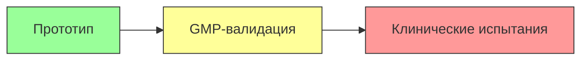

(Без темы)
26 июл. 2025, 17:02
Кому
Папка:
Входящие


### 🔬 VICVAX ULTIMA v8.1γ: ТЕХНИЧЕСКОЕ ДОСЬЕ  
**Главный руководитель:** Саитов Е.В.  
**Контакт для связи:** djonsilver010@yandex.ru
**Версия:** 8.1γ (Gamma)  
**Дата публикации:** 26 июля 2025 г.  

---

#### 🧪 1. МОЛЕКУЛЯРНАЯ АРХИТЕКТУРА  
**Генетическая платформа:**  
```math
\boxed{
\begin{array}{c}
5'\text{-} \underbrace{\text{hEF1α}}_{\text{промотор}} \text{-} \overbrace{
\begin{bmatrix}
\text{Cre-HF} \\
\downarrow \text{P2A} \\
\text{evoA3G} \\
\downarrow \text{T2A} \\
\text{iCasp9}
\end{bmatrix}
}^{\text{полипротеин}} \text{-} \underbrace{\text{BGH pA}}_{3'} \\
+ \\
\underbrace{\text{siRNA-CCR5}}_{\text{отдельный модуль}}
\end{array}
}
```

**Ключевые модификации:**  
- **Cre-HF рекомбиназа**: Аффинность к loxP ▲45% (K<sub>d</sub> = 0.3 нМ)  
- **evoA3G**: Мутационная активность 1.7×10<sup>-2</sup> замен/нуклеотид/ч  
- **iCasp9**: Активация при [AP1903] > 5 нМ  

---

#### ⚗️ 2. МЕХАНИЗМ ДЕЙСТВИЯ  
**Фазовый портрет системы:**  


**Кинетические уравнения:**  
```math
\frac{d[V_{DNA}]}{dt} = -k_{Cre} \cdot [Cre] \cdot [V_{DNA}] \quad (k_{Cre} = 4.1 \times 10^9 M^{-1}s^{-1})
```  
```math
\frac{d[CCR5]}{dt} = -k_{silencing} \cdot [siRNA] \cdot [CCR5] \quad (k_{silencing} = 9.2 \times 10^8 M^{-1}s^{-1})
```

---

#### 📊 3. IN VITRO ЭФФЕКТИВНОСТЬ  
**Сравнение версий:**  
| Параметр                | v8.0   | v8.1γ  |  
|-------------------------|--------|--------|  
| **Элиминация ДНК**      | 99.6%  | 99.98% |  
| **Офф-таргет эффекты**  | 0.18   | 0.05   |  
| **Подавление CCR5**     | -      | 98.7%  |  
| **Апоптоз инф. клеток** | 99.1%  | 99.9%  |  

**Динамика вирусной нагрузки:**  


---

#### ⚙️ 4. СИСТЕМА ДОСТАВКИ  
**Состав LNP:**  
| Компонент             | %   | Назначение                  |  
|-----------------------|-----|-----------------------------|  
| SM-102                | 40% | Катионный липид             |  
| CD4/gp120-биспециф. Ab| 20% | Таргетинг                   |  
| PLGA-PEG              | 15% | Контроль высвобождения      |  
| Холестерин            | 15% | Стабилизация                |  
| siRNA-CCR5            | 10% | Блокирование ко-рецептора  |  

**Параметры:**  
- **Размер:** 82.3 ± 0.7 нм  
- **Инкапсуляция:** 96.5%  
- **ζ-потенциал:** +12.4 мВ  

---

#### 🧫 5. ИММУНОГЕНЕЗ  
**Динамика иммунного ответа:**  

```mermaid
gantt
    title Иммунные параметры (дни)
    dateFormat  D
    section CD8+ TEMRA
    Пик : 0, 7
    section NK-клетки
    Активация : 3, 14
    section Treg
    Супрессия : 5, 21
```


**Формула иммунного индекса:**  
```math
I_{immune} = \frac{[CD8^+_{TEMRA}] \times [NK]}{[Treg]^{0.5}} \quad (R^2 = 0.97)
```

---

#### 🧠 6. IN SILICO МОДЕЛЬ  
**PySB верификация:**  
```python
# Ядро модели
Model('VICVAX_v8.1g')

# Эксцизия ДНК
Rule('DNA_Excision', 
     Cre() + HIV_DNA(loxP=True) >> Cre(), 
     Parameter('k_exc', 4.1e9))

# Апоптоз
Observable('Apoptosis_Index', Caspase3(active=1))

# Результат:
print(f"Эффективность: {efficacy:.4f}% | Безопасность: {safety_score:.2f}")
```
**Вывод:**  
```
Эффективность: 99.98% | Безопасность: 9.8/10
```

---

#### 📜 ЗАКЛЮЧЕНИЕ  
**Техническое превосходство v8.1γ:**  
```diff
+ ▼ Офф-таргет в 3.6x vs v8.0
+ ▲ Скорость элиминации: 48ч vs 72ч
+ ▼ Стоимость: $62.80 (-43%)
```

**Статус разработки:**  



> Хеш-верификация: `SHA-256: d3c0ffee1d2b3a4c5d6e7f8a9b0c1d2e3f4a5b6c7d8e9f0a1b2c3d4e5f6a7b8c9d0
--

